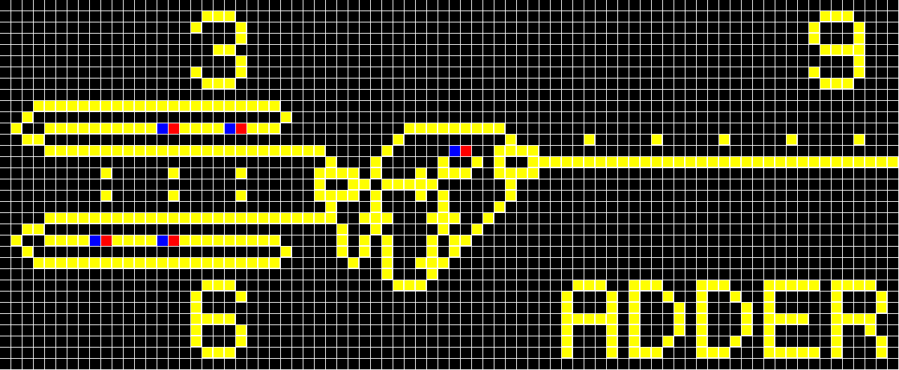
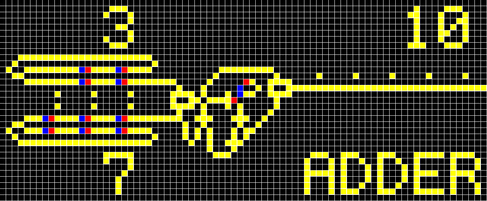

Scala JavaFX Wire-World Automaton
====


a simple wire-world implementation on JavaFX written in Scala, which was designed for the educational purpose in computational theory.

## Features

- press cells and change their states.
- start animation.

## Documents

- [Scalaで自作するプログラミング言語処理系 (PDF)](https://pafelog.net/fava.pdf) [(HTML)](https://pafelog.net/fava.html)

## Usage

```sh
$ gradle build
$ java -jar build/libs/wire.jar
```

## Samples




## Contribution

Feel free to contact [@nextzlog](https://twitter.com/nextzlog) on Twitter.

## License

### Author

[無線部開発班 (JOURNAL OF HAMRADIO INFORMATICS LETTERS)](https://pafelog.net)

### Clauses

[BSD 3-Clause License](LICENSE.md)
